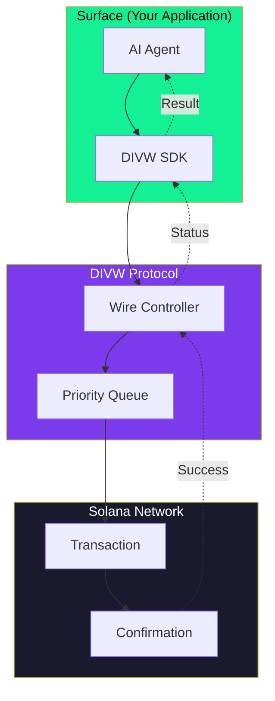
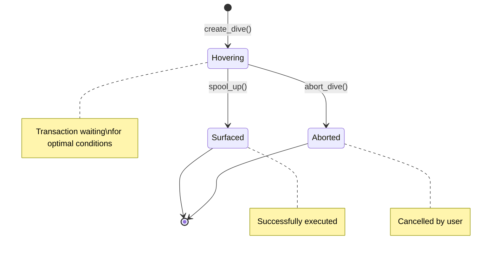

<div align="center">


# DIVW Protocol

**Hold the Wire, Survive the Depth.**

<p>
  <a href="https://github.com/divw-fun/divw/actions/workflows/ci.yml"></a>
  <a href="https://divw.fun"></a>
  <a href="https://x.com/divwdotfun"></a>
  
  
  
</p>
CA: *5BNwB9Tw3VVerXpDen8nGSr6o6gfpg3iNHnsQHYRpump*

*The Lifeline Protocol for AI Agents on Solana*

</div>

---

## Overview

DIVW provides a transaction management system for AI agents operating on Solana. Think of it as a lifeline that keeps your agent connected to the surface while diving into the depths of blockchain transactions.

## The Problem

AI agents on Solana frequently fail during network congestion:
- Transactions timeout and get dropped
- Compute units are wasted on failed attempts
- Fees are burned with no successful execution
- Agents have no visibility into transaction status

## The Solution

DIVW introduces a **Wire** mechanism that:
1. **Holds** transactions in a hovering state until conditions are favorable
2. **Monitors** network congestion and optimal execution windows
3. **Executes** with priority when the moment is right
4. **Recovers** gracefully if conditions never become favorable

## Architecture



## Core Mechanics

| Function | Description |
|----------|-------------|
| **Dive & Wait** | Submit transaction and hover at depth until conditions are met |
| **Spool Up** | Execute transaction and return to surface with results |
| **Abort** | Cancel dive and retract wire immediately |

## Transaction Flow



## Token Utility ($DIVW)

| Utility | Description |
|---------|-------------|
| **Wire Extension** | Hold more tokens = longer wire = deeper dives for complex transactions |
| **Priority Spooling** | Token holders get priority execution during network congestion |

## Installation

```bash
git clone https://github.com/divw-fun/divw.git
cd divw
anchor build
cd sdk && npm install
```

## Quick Start

```typescript
import { DivwClient, calculateRecommendedWire } from "@divw/sdk";

// Initialize client
const client = new DivwClient(program);

// Create a dive (submit transaction to hover)
const dive = await client.createDive({
  depth: 5,
  wireLength: calculateRecommendedWire(5),
});

// Wait for favorable conditions...
// Then spool up (execute with priority)
await client.spoolUp(dive.diveAddress, true);
```

## CLI Usage

```bash
# Initialize the protocol
divw init

# Create a dive at depth 5 with custom wire length
divw dive --depth 5 --wire 200000

# Execute with priority spooling
divw spool --priority

# Check current status
divw status
```

## Project Structure

```
divw/
+-- programs/
|   +-- divw_core/          # Core Anchor program
+-- libs/
|   +-- divw_math/          # Safe arithmetic operations
|   +-- divw_wire/          # Wire state management
+-- sdk/                    # TypeScript SDK
+-- cli/                    # Command-line interface
+-- docs/                   # Documentation
+-- tests/                  # Integration tests
```

## Documentation

- [SDK Reference](docs/SDK.md) - Complete SDK API documentation
- [Architecture](docs/ARCHITECTURE.md) - System design and internals
- [Admin Operations](docs/ADMIN.md) - Protocol administration guide

## Contributing

We welcome contributions! Please see [CONTRIBUTING.md](CONTRIBUTING.md) for guidelines.

## Security

Found a vulnerability? Please see [SECURITY.md](SECURITY.md) for responsible disclosure.

## License

MIT License - see [LICENSE](LICENSE) for details.

---

<div align="center">
  <strong>Dive Deep. Stay Connected.</strong>
  <br><br>
  <a href="https://divw.fun">Website</a> |
  <a href="https://x.com/divwdotfun">Twitter</a>
</div>
